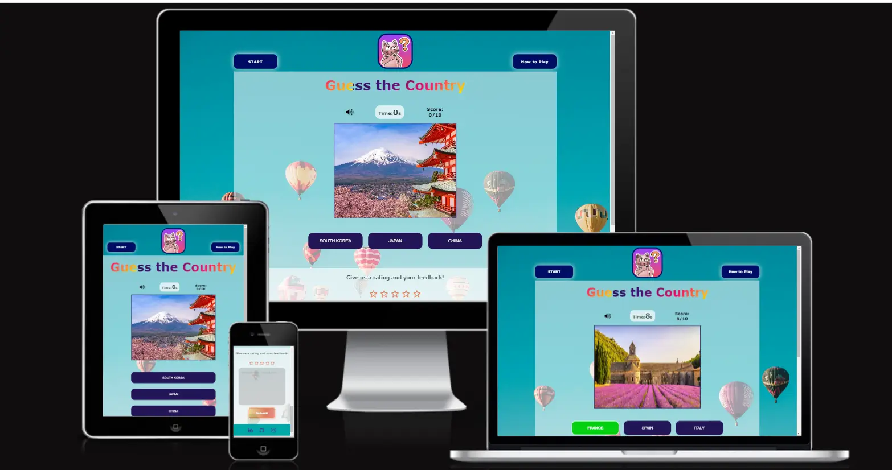
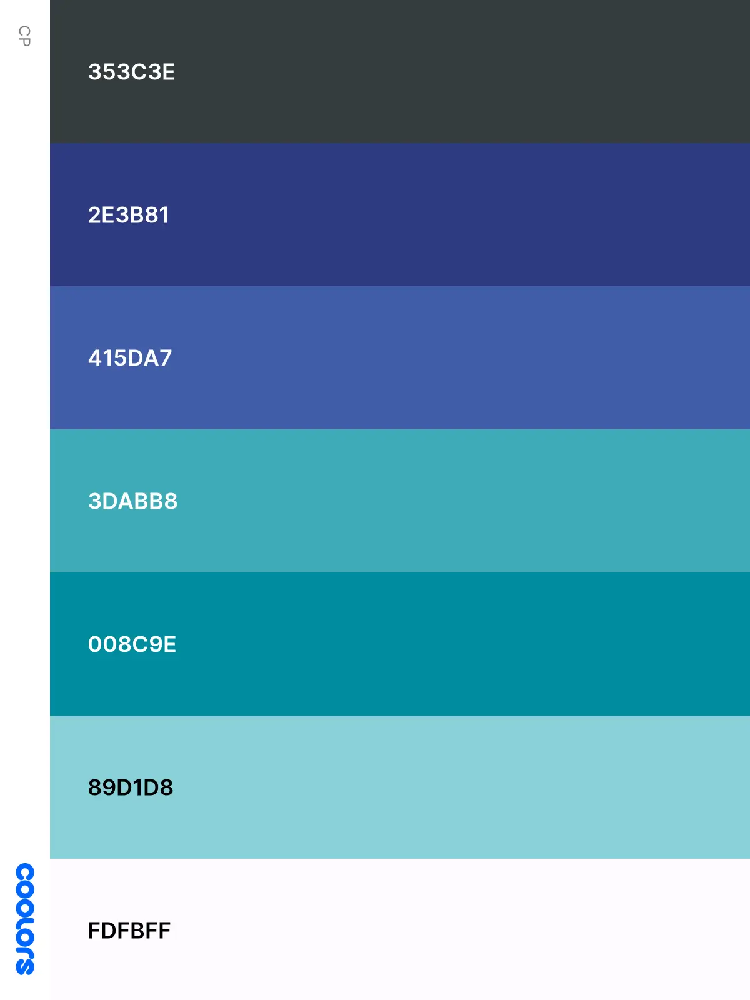

# Portfolio Project 2
##  Guess the Country
Guess the Country is a free multi-landmark guessing game where a landmark image is shown and three options or hints are given to the player to guess the exact country name corresponding to the landmark within a 30 seconds alloted time. The main objective of this website is to create a fully functional guessing game that will help increase general knowledge about geography, the world and its amazing places, and help improve deductive reasoning, social skills and memory recognition.

[View the live website here.] <a href="https://preetzware.github.io/guess-the-country/" target="_blank">Guess the Country</a>

## Table Of Content
- [User Experience](#user-experience)
  - [Target Audience](#target-audience)
  - [User Stories](#user-stories)
- [Design](#design)
  - [Colour Scheme](#colour-scheme)
  - [Typography](#typography)
  - [Images](#images)
  - [Wireframes](#wireframes)
- [Features](#features)
  - [Game Screen](#Game-Screen)
  - [Modals](#Modals)
  - [404 Page](#404-page)
- [Future Features](#future-features)
- [Testing](#testing)
- [Technologies And Languages](#technologies-and-languages)
- [Deployment](#deployment)
  - [Creating A Fork](#creating-a-fork)
  - [Cloning Repository](#cloning-repository)
- [Credits](#credits)
  - [Media](#media)
  - [Code](#code)
  - [Acknowledgements](#acknowledgements)
  - [Comments](#comments)

## User Experience
###  Target Audience
- People who like geography and are fascinated by stunning places and the wonders of the world.
- People who love travelling and might come across places they have visited already or might discover their next travel destination through this game.
- Children who want to play an interesting game that increases their geographical knowledge about countries and places.
- Visually impaired people who can also enjoy this guessing game.
- This game can inspire and motivate any audience to travel and witness the beauty of the world.

###  User Stories

As a first time user, my aim is to:

1. Be able to easily access the website and understand the purpose of its existence.
2. Be able to learn how to play the game and understand the rules or instructions set for guiding me through. 
3. Find good quality images to be able to better see the landmark and better guess the answer through legible options provided.
4. Be able to acknowledge if I answered the correct/wrong answer when clicking on the option buttons.
5. Be able to see the timer to know how much time I have left to guess the answer.
6. Be able to acknowledge my actual score.
7. Be able to acknowledge my final score when the game is over.
8. Be able to provide my experience about the game and my feedback to improve certain features in the game.
9. Be able to rate the game as per my liking.
10. Be able to turn off the game sound.
10. Be able to navigate through the links provided.

## Design

### Color Scheme
The color scheme for this website was greatly inspired by the background image that was downloaded from unsplash.com website and the logo that was downloaded from ios icon gallery. From background color, the other colors were chosen to create a good contrast and a dynamic effect throughout the website. The rest colors were generated from Coolors palette generator and the following pleasing color combinations were created in hex value: 

### Typography

Built-in font family Verdana was used throughout this website, with fallback fonts such as Sans-serif and Tahoma. 

## Imagery
The background image was downloaded from <a href="https://unsplash.com/photos/assorted-color-hot-air-balloons-during-daytime-DuBNA1QMpPA" target="_blank">unsplash.com</a> and the logo was taken from <a href="https://www.iosicongallery.com/" target="_blank">ios icon gallery</a> while the landmark images were wisely chosen from Pinterest with the exception of Sénanque Abbey (France) imagery which was taken from Shutterstock website. After Lighthouse testing, all images were converted into webp format to improve the website's performance.

## Wireframes
The first and foremost wireframes for this website were made using paper and pencil. Thereafter they were digitally designed using Balsamiq.com with some light modifications. Guess the Country is a one page website consisting of six modals used to keep vistors engaged. 
1. *Homepage Wireframe*

2. *Menu Page Wireframe*

3. *Gallery Page Wireframe*

4. *Sign-Up Page Wireframe*

5. *Thank You Page Wireframe*

## Features

### Game Screen Components

**1.** <u>**Logo and Buttons**</u>

Guess the Country is a one page website designed simply, with some amount of interactivity and a touch of elegance. The desktop game screen features the 'guessing cat' logo in the top-center and two buttons on its either side - a start button and a 'How to Play' button. While the mobile game screen features the logo on the very top and the same two buttons below it, styled differently.

**2.** <u>**Title**</u>

The title has been styled into a gorgeous text animation effect. Credit goes to <a href="https://alvarotrigo.com/blog/css-text-animations/" target="_blank">alvarotrigo.com</a>

**3.** <u>**Sound/Timer/Score Components**</u>

A mute and unmute icon from frontawesome website can be found on left below the title. Special sound effects from Pixabay have been added in addition to the color transform effect on option buttons when clicked. An enthusiastic sound can be heard when the right answer is clicked and if the sound is on unmute mode, else if wrong answer is clicked, a disappointing tune can be heard. The sound can be muted or unmuted as per the visitor's preference.

The Score is positioned on the right side below the title and it will keep updating when the game is on. 

The timer is placed in the middle of the mute/unmute button and the score so that all three major components are visible on the user's screen when playing the game. 

**4.** <u>**Landmark Images**</u>
Landmark images situated below the sound/timer/score components will appear back-to-back when the game will be on.

**5.** <u>**Option Buttons**</u>
Three option buttons are featured below each landmark image.

**6.** <u>**Star Rating and form**</u>
The star rating and feedback form that appear below the the option buttons can be partly credited to this YouTube tutorial: https://www.youtube.com/watch?v=lqrsLpcGTes&t=3s. The first star could not be fully unmarked once clicked and I fixed this by adding a 'remove star rating' function. Both ratings and feedback area are required in order to submit the form.

- ### Footer
At the bottom of the page, a simple footer features three social media icon links namely LinkedIn, Github and Instagram.

- ### Modals
In total, six modals have been integrated in this website with the aim to grab users’ attention, enhance user engagement and improve user experience.

 Modal | Appearance/Purpose
---------------|---------------
**Start Message Pop-up**   | Appears when user straightaway clicks on answer options. Alerts and guides user to click on Start button to play.
**User Name Pop-up**   | Appears on clicking on START button. Required to register the user's name and for game to start with timer on. Required for personalising pop-ups for user.
**How to Play Pop-up**   | Appears on clicking on How to Play button. Provides information/instruction on how to play the game.
**Time-up Pop-up**   | Appears when allotted 30 seconds to answer any question is over. To create a sense of urgency and purpose, and help user stay on track and avoid distractions.
**Game End Pop-up**   | Appears at the end of the game after the tenth image is guessed. It provides final score of the user and show appreciation for playing the game.
**Congratulations Pop-up**   | Appears with a cheering sound effect at the end of the game only when the user has clicked on all correct options and scored ten on ten. This win sound effect accompanying this pop-up shows appreciation to the best scorer and conveys congratulations message.
**Feedback Pop-up**   | Appears when user clicks on submit button in feedback section. To thank the user for their feedback and rating.

- ## 404 page

## Future Implementations

At some point in the future, I would like to add a welcome page that will feature two more topics aside landmarks like 'People' and 'Food' so when the user will click in one of these category, the game screen will open up displaying related images and options with all the rest components. I will also add a score track and a star rating track to render the game more interesting.

## Accessibility

Generally, aria labels as well as alt texts have been used on images and icons to make it more accessible for users with low vision, users with mobility disabilities and users with memory loss. 

## Technologies Used

1. **Github** - used for version control, site storage and for deploying my project.
2. **Gitpod** - the IDE I have used to write, edit, commit and push my code to Github.
3. **HTML 5** - language used to build the core of my website.
4. **CSS** - the style sheet language I have used to style all the elements of my website.
5. **JavaScript** - used to add interactivity in the website.
6. **DevTools** - used for Lighthouse testing, to test the responsiveness of my website and to check for bugs.
7. **PageSpeed Insights** - used to test the performance of the website.
8. **Wave Chrome Extension** - 
9. **Font Awesome** - used to import social media and other icons.
10. **Pinterest** - used to source website's imageries.
11. **TinyPNG** - used to compress my website's imageries.
12. **Favicon.io** - used to create favicon for my website.
13. **Balsamiq** - used to create the wireframes for the initial design process of my website.
14. **Pixabay**  - used to download sound effects for the game.
15. **Am I Responsive?** - used to test the responsiveness of the website.

## Languages Used
HTML 5, CSS, JavaScript

## Libraries and programmes
Github was used for version control, site storage and for deploying my project to Github pages. Gitpod is the IDE I used to write, edit, commit and push my code to Github.

## Deployment
The website was deployed on Github pages. The steps are as follows:

1. Go to Github repository and open the repository
2. Click on the settings option in the repository 
3. Select the branch from where you want to host your project 
4. Click on the save option and the link will be available in some time
5. Open the project in any browser 

### Local Deployment 

**Steps to clone:**

1. Navigate to GitHub repository.
2. Go to the repository of this project https://github.com/preetzware/Bubble-Tea-Project.git
3. Click on the code button, and copy your preferred clone link.
4. Open the repo in Gitpod by prefixing the URL with: gitpod.io/#.
5. Confirm the workspace creation.

## Testing

### Manual Testing

# Testing
Testing document can be found [here](Testing.md)

## Known Bugs

Bug | Status 
----|-------
Horizontal scroll on smaller screen sizes| Resolved; adjusted size of images and used CSS overflow-x value on HTML property.
Getting error 'Could not read property null' when adding favicon to workspace | Resolved; renamed and saved favicons in another folder before adding to workspace.
From option button when clicked on correct or wrong answer button, the green or red color was not taking effect| Resolved; removed hover effect on the option buttons and applied hover effect on the text and border instead.
Set timer was given 2000ms to generate the next image and options, but when user immediately clicked on the answer buttons back-to-back, sound was delayed and not produced | Resolved, aSet timer interval was increased to 3000ms.
Initially user could click on all three options instead on one only | Resolved; other two incorrect option buttons were disabled in JavaScript. 
Modals were not displaying in the center of the screens | Resolved; top and left position values were updated in CSS .
From lighthouse test, found that images were too large that delayed loading of the page  | Resolved; Converted all images into webp format in tinypng.

## Credits

- My mentor, for reviewing my project and giving useful advice to improve it.
- J. Janardhan, for his valuable support and advice throughout the project.
- Brian McConway, for drawing my attention to few bugs that I could fix on time, and for always motivating me.
- Niclas_5p_lead from Slack community, to point out few bugs and improvements on styling, thanks to him I could fix the issues.
- YouTube video tutorials:
 - How to create Star Rating form: 
 <https://www.youtube.com/watch?v=lqrsLpcGTes&t=3s> 
 - Creating page title CSS animation:
 <https://alvarotrigo.com/blog/css-text-animations/>

## Acknowledgements

- Friends, family,  and colleagues, for testing my project at every stage, and also for their feedback.
- My Mentor for constructive feedback and direction.
- My cohort coordinator Amy for always being there and provide guidance.
- My tutors from Code Institute, for their valuable assistance.
- Student Care for their valuable support.
- The Code Institute, for all the facilities and support.