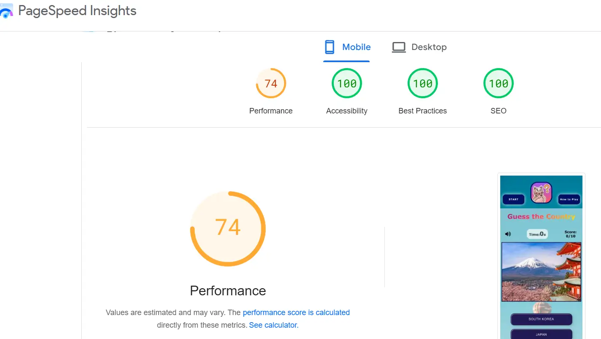

<h1> PP2 Testing </h1>

# Table of Contents
- [Table of Contents](#table-of-contents)
  - [Manual Testing](#manual-testing)
  - [Browser Testing](#browser-testing)
  - [Device Testing](#device-testing)
  - [Validator Testing](#validator-testing)
  - [Lighthouse Testing](#lighthouse-testing)
  - [Accessibility Testing](#accessibility-testing)

| Feature | Expected Outcome | Testing Performed | Result | Pass/Fail |
| ------- | ---------- | ---------- | -------- | ------- |
| START Button| When clicked a pop-up window will appear requesting the user to enter their name which is required and upon doing so and clicking on **OK** button, pop-up closes and game starts with time ticking. | Clicked START | Pop-up window show up, input added, OK clicked, game starts, timer ticking starts. | Pass |
| How to Play Button| When clicked a pop-up window will show up in the center of the screen, containing step by step instruction on how to play the game with information on the allocated time to play. Clicking on **GOT IT!** button will close the modal window.| Clicked How to Play | Pop-up window opens, GOT IT! clicked, window closed | Pass |
| Start  Link | When clicked the user will be redirected to the Menu page. | Clicked link | Redirected to the About page. | Pass |
| Gallery Link | When clicked the user will be redirected to the Gallery page. | Clicked link | Redirected to the Portfolio page. | Pass |
| Sign Up Link | When clicked the user will be redirected to the Sign Up page. | Clicked link | Redirected to the Contact page. | Pass |
| --- | --- | --- | --- | --- |
| `Footer` |
|  |  |  |  |  |
| Social Media Icons | When clicked the user will be redirected to the appropriate social media pages in a new window. | Clicked icon | Redirected to the social media page in a new window. | Pass |
| Address Link | When clicked the user will be directed to the external link in Google maps.| Clicked link | directed to the Google maps exact location. | Pass |
| --- | --- | --- | --- | --- |
| `Home Page` |
|   |   |   |   |
| Menu button | When clicked the user will be redirected to the Menu page. | Clicked button | Redirected to the Menu page. | Pass |
| Offers Link | When clicked the user will be redirected to the Menu page.| Clicked link | Redirected to the Menu page. | Pass |
| 15% Discount Link | When clicked the user will be redirected to the Sign Up page. | Clicked link | Redirected to the Sign Up page. | Pass |
| --- | --- | --- | --- | --- |
| `Menu Page` |
|   | 

## Manual Testing
Manual testing was done on a MacBook Pro 2015 13in, running Mojave version 10.14.6 in Google Chrome.

Feature Tested | Expected Result | Actual Result | Pass/Fail
---------------|-----------------|---------------|----------
Rules Modal | When clicked, should trigger a modal to pop up with an overlay over the rest of the screen, preventing the user from clicking anything other than the close button. | As expected | Pass
Music Toggle | When clicked, should start music playing in the background if device volume is turned on. When clicked a second time, should pause the music. | As expected | Pass
Keyboard keys | When letter is clicked, should appear in relevant tile on the grid. | As expected | Pass
Enter key | When clicked after filling a row with letters, should flip tiles and change colour of keys and tiles depending on whether a letter is in the word and in the right place, in the word but in the wrong place, or not in the word at all. | As expected | Pass
Correct word | When the correct word is entered, all tiles should flip and turn green, triggering a pop up message. | As expected | Pass
Win message | Message that pops up when you guess the correct word should contain a button which when clicked should refresh the page and reset the game. | As expected | Pass
Game over message | Should the user get the wrong word in the last row, a pop up message containing a button which when clicked should refresh the page and reset the game should appear. | As expected | Pass

## Browser Testing 
The website was tested on the following browsers:

Browser Tested | Working Status
---------------|---------------
Chrome | Works as expected
Firefox | Works as expected
Microsoft Edge | Works as expected
Mac OS Safari | Works as expected

## Device Testing
The website was tested on the following devices:

Device Tested | Working Status
--------------|---------------
iPhone 14 | Works as expected
Huawei Nova T5 | Works as expected
Samsung S7 | Small amount of vertical scroll as expected but still functional
Huawei P30 Lite | Works as expected
Samsung A21s | Works as expected
iPhone SE 2020 | Works as expected
iPhone X | Works mostly as expected, keyboard slightly off center but functional
iPhone 7 | Works as expected
iPad (unsure of model or year)| Works as expected
Samsung Galaxy S20 FE | As expected
iPhone 11 Pro | Mostly as expected, keyboard slightly cut off but functional
iPhone 11 | Mostly as expected, keyboard slightly cut off but functional

## Validator Testing
### HTML Validation

**404 HTML**

### CSS Validation

### JavaScript Validation

## Lighthouse Testing

**Desktop Performance**

**Mobile Performance**

### PSI Testing
Google PageSpeed Insights (PSI), a free tool was utilized for gauging the performance and accessibility measures of the website. Initially, the performance and speed was not so highly rated generally because of the large images and lack of aria labels. I tried to compress and convert many of the images from jpeg format to png, and I added missing aria labels to elements for better accessibility which significantly improved the performance of my website. Below are the final PSI results:

## Accessibility Testing

**Wave Testing**
